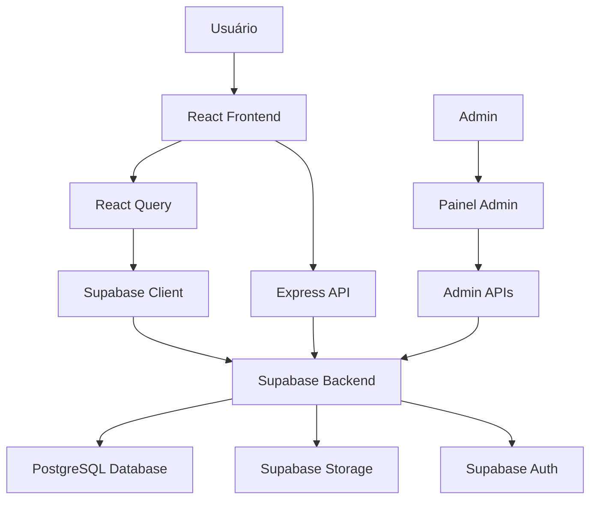

# Estrutura do Projeto

Documentação detalhada da estrutura de arquivos e diretórios do projeto FAETERJ Rio.

## 📁 Árvore de Diretórios Completa

```
faeterjrio/
├── .builder/                    # Configurações de build
│   └── rules/                   # Regras de deploy e organização
├── .git/                        # Controle de versão
├── .windsurf/                   # Configurações do Windsurf
│   └── cascade-instructions.md  # Instruções para o assistente
├── client/                      # Frontend React Application
│   ├── components/              # Componentes React
│   │   ├── ui/                 # Componentes UI reutilizáveis (shadcn/ui)
│   │   │   ├── button.tsx
│   │   │   ├── card.tsx
│   │   │   ├── dialog.tsx
│   │   │   └── ...             # Outros componentes UI
│   │   ├── AccessDock.tsx      # Componente de acesso rápido
│   │   ├── CoursesSection.tsx  # Seção de cursos
│   │   ├── FloatingNavbar.tsx # Navegação flutuante principal
│   │   ├── Footer.tsx          # Rodapé do site
│   │   ├── Header.tsx          # Cabeçalho
│   │   ├── HeroSection.tsx    # Hero principal
│   │   └── ...                 # Outros componentes
│   ├── hooks/                   # Hooks personalizados
│   │   ├── use-mobile.tsx      # Hook para detecção de mobile
│   │   ├── use-toast.ts        # Hook para notificações
│   │   └── useLogoColor.ts     # Hook para cor do logo
│   ├── lib/                     # Bibliotecas e utilitários
│   │   ├── supabase.ts         # Cliente Supabase
│   │   ├── utils.ts            # Utilitários gerais
│   │   └── utils.spec.ts       # Testes dos utilitários
│   ├── pages/                   # Páginas da aplicação
│   │   ├── admin/              # Páginas administrativas
│   │   │   ├── AdminLayout.tsx # Layout admin
│   │   │   ├── AdminLogin.tsx  # Login admin
│   │   │   ├── AdminDashboard.tsx # Dashboard
│   │   │   ├── AdminEditor.tsx # Editor de posts
│   │   │   ├── AdminUsers.tsx  # Gestão de usuários
│   │   │   └── AdminSetup.tsx  # Setup inicial
│   │   ├── AboutPage.tsx       # Sobre nós
│   │   ├── AdmissionPage.tsx   # Admissão
│   │   ├── ComunicadosPage.tsx # Lista de comunicados
│   │   ├── LoginCoruja.tsx     # Login portal aluno
│   │   ├── MatrizEmentas.tsx   # Matriz de ementas
│   │   ├── PostDetailPage.tsx  # Detalhes do post
│   │   ├── Index.tsx           # Home page
│   │   └── NotFound.tsx        # Página 404
│   ├── App.tsx                  # Componente principal com rotas
│   ├── global.css              # Estilos globais e Tailwind
│   └── vite-env.d.ts           # Tipos do Vite
├── netlify/                     # Configuração Netlify Functions
│   └── functions/
│       └── api.ts              # API serverless
├── public/                      # Assets estáticos públicos
│   ├── fonts/                   # Fontes customizadas
│   │   ├── faeterj-Semibold.otf
│   │   └── faeterj-SemiboldOblique.otf
│   ├── android-chrome-192x192.png
│   ├── android-chrome-512x512.png
│   ├── apple-touch-icon.png
│   ├── favicon.ico
│   ├── favicon.svg
│   ├── manifest.json
│   ├── robots.txt
│   └── _redirects              # Redirecionamentos Netlify
├── server/                      # Backend Express Server
│   ├── routes/                  # Endpoints da API
│   │   └── demo.ts             # Rota de exemplo
│   ├── index.ts                # Configuração principal do servidor
│   └── node-build.ts           # Build para produção
├── shared/                      # Código compartilhado
│   └── api.ts                  # Interfaces de API
├── supabase/                    # Configuração Supabase
│   └── migrations/             # Migrations do banco
│       ├── 001_create_posts_table.sql
│       ├── 001_setup_complete.sql
│       └── ...                 # Outras migrations
├── docs/                        # Documentação do projeto
│   ├── PROJECT_STRUCTURE.md    # Este arquivo
│   ├── FRONTEND.md             # Documentação frontend
│   ├── BACKEND.md              # Documentação backend
│   ├── SUPABASE.md             # Documentação Supabase
│   └── DEPLOYMENT.md           # Guia de deploy
├── .dockerignore               # Arquivos ignorados no Docker
├── .env                        # Variáveis de ambiente (local)
├── .env.backup                 # Backup das variáveis
├── .env.example               # Exemplo de variáveis
├── .gitignore                 # Arquivos ignorados pelo Git
├── .npmrc                     # Configuração NPM
├── .prettierrc                # Configuração Prettier
├── AGENTS.md                  # Instruções para agentes
├── components.json            # Configuração shadcn/ui
├── index.html                 # Template HTML principal
├── netlify.toml               # Configuração Netlify
├── package.json               # Dependências e scripts
├── pnpm-lock.yaml            # Lock file PNPM
├── postcss.config.js         # Configuração PostCSS
├── tailwind.config.ts        # Configuração TailwindCSS
├── tsconfig.json             # Configuração TypeScript
├── vite.config.ts            # Configuração Vite (client)
└── vite.config.server.ts     # Configuração Vite (server)
```

## 🏗️ Arquitetura do Projeto

### Frontend (Client/)
**Tecnologia**: React 18 + TypeScript + Vite

#### Components/
- **ui/**: Biblioteca de componentes baseada em shadcn/ui
  - Componentes reutilizáveis e acessíveis
  - Design system consistente
  - Totalmente customizável

- **Componentes de Página**: Componentes específicos do negócio
  - `FloatingNavbar.tsx`: Navegação principal flutuante
  - `HeroSection.tsx`: Seção hero da home
  - `CoursesSection.tsx`: Seção de cursos
  - `AccessDock.tsx`: Área de acesso rápido

#### Pages/
- **admin/**: Sistema administrativo completo
  - Layout dedicado com sidebar
  - Sistema de autenticação
  - CRUD de posts e usuários

- **Públicas**: Páginas do portal institucional
  - Home com carrossel dinâmico
  - Sistema de comunicados
  - Informações institucionais

#### Hooks/
- Hooks personalizados para lógica reutilizável
- Integração com Supabase
- Estado global da aplicação

### Backend (Server/)
**Tecnologia**: Express.js + TypeScript

#### Routes/
- Endpoints RESTful
- Middleware de autenticação
- Validação com Zod

#### Integração
- Servidor integrado com Vite dev server
- Hot reload para ambos frontend e backend
- Single port em desenvolvimento (8080)

### Shared/
**Propósito**: Código compartilhado entre frontend e backend

#### api.ts
- Interfaces TypeScript para APIs
- Type safety em toda aplicação
- Contratos de dados consistentes

### Supabase/
**Função**: Backend as a Service

#### Migrations/
- Schema versionado do banco
- Evolução controlada da estrutura
- Deploy automatizado

#### Configurações
- Políticas RLS (Row Level Security)
- Autenticação e autorização
- Storage para arquivos estáticos

## 🔄 Fluxo de Dados



## 🎯 Padrões e Convenções

### Nomenclatura
- **Components**: PascalCase (`FloatingNavbar.tsx`)
- **Files**: kebab-case para assets (`faeterj-logo.svg`)
- **Variables**: camelCase no código
- **Constants**: UPPER_SNAKE_CASE

### Estrutura de Componentes
```typescript
// Interface primeiro
interface ComponentProps {
  // props
}

// Componente principal
export default function Component({ ...props }: ComponentProps) {
  // Lógica
  
  return (
    // JSX
  );
}
```

### Organização de Imports
```typescript
// 1. React e bibliotecas externas
import React from 'react';
import { motion } from 'framer-motion';

// 2. Componentes UI
import { Button } from '@/components/ui/button';

// 3. Componentes locais
import { LocalComponent } from './LocalComponent';

// 4. Utilitários e hooks
import { useCustomHook } from '@/hooks/use-custom-hook';
import { cn } from '@/lib/utils';
```

## 🔧 Configurações Importantes

### Path Aliases (tsconfig.json)
```json
{
  "paths": {
    "@/*": ["./client/*"],
    "@shared/*": ["./shared/*"]
  }
}
```

### Variáveis de Ambiente
- `.env`: Desenvolvimento local
- `.env.example`: Template com todas as variáveis
- `netlify.toml`: Configuração de produção

### Build Process
- **Client**: Vite build para SPA
- **Server**: Build separado para produção
- **Deploy**: Netlify Functions para serverless

## 📊 Performance e Otimização

### Code Splitting
- Rotas lazy loaded
- Componentes dinâmicos
- Vendor chunks separados

### Cache Strategy
- Service Worker para assets
- Cache de API com React Query
- CDN para imagens

### Bundle Optimization
- Tree shaking automático
- Minificação de código
- Compressão gzip

## 🚀 Escalabilidade

### Frontend
- Component-based architecture
- State management centralizado
- Lazy loading de rotas

### Backend
- API RESTful escalável
- Database connection pooling
- Serverless deployment

### Database
- Schema versionado
- Índices otimizados
- Backup automático

---

Esta estrutura permite desenvolvimento rápido, manutenibilidade e escalabilidade para o portal FAETERJ Rio.
